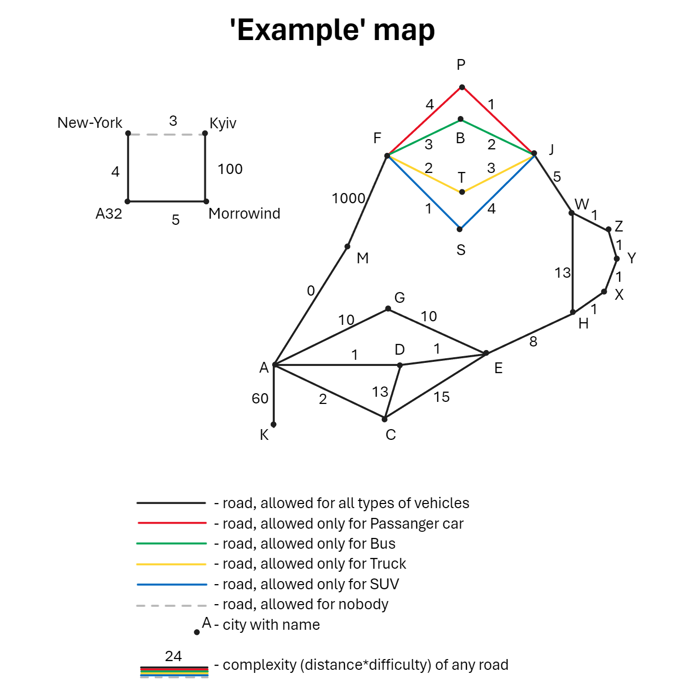

# Final Task: Fuel-Efficient Route Finder

This repository contains a solution for finding the most fuel-efficient trip between cities based on a given map and the type of vehicle. The solution utilizes object-oriented programming, handling various road types, vehicle restrictions, and road complexity. A detailed map visualization (provided as [`Example_visualisation.png`](https://github.com/naumovakotya/Python_Programming_School/blob/main/HW_Final_task/Example_visualisation.png)) showcases the available paths and conditions.

## Problem Overview
You are given a map of cities and roads (stored in a CSV file). Each road has a complexity factor that affects fuel consumption, and certain types of vehicles are prohibited from using some roads. The task is to find the most fuel-efficient route between cities, considering all road restrictions and fuel consumption formulas for different vehicle types.

### Key Concepts:
1. **Cities (Nodes)**: Each city is represented as a node on the map.
2. **Roads (Edges)**: Roads between cities have distances, complexity, and restrictions for different vehicle types.
3. **Vehicle Types**: Different types of vehicles have varying maneuverability and fuel consumption, which affect how efficiently they can travel across roads.

## Available Vehicles:
- **Passenger Car** (maneuverability = 3, consumption = 10, id = 1)
- **Bus** (maneuverability = 1, consumption = 15, id = 2)
- **Truck** (maneuverability = 2, consumption = 12, id = 3)
- **SUV** (maneuverability = 6, consumption = 18, id = 4)

## Calculation of Fuel Consumption:
For each road, fuel consumption is calculated using the formula:

`Fuel Consumption = (distance * consumption / 100) * (road complexity / vehicle maneuverability)`

## Program Structure:
1. **Cities and Roads**:
   - Cities are represented by the `City` class, while roads are represented by the `Road` class. Both are managed by the `Map` class, which stores the city and road objects, and handles pathfinding.

2. **Vehicles**:
   - Vehicle classes (`PassengerCar`, `Bus`, `Truck`, `SUV`) are defined in the [`cars.py`](https://github.com/naumovakotya/Python_Programming_School/blob/main/HW_Final_task/cars.py) module. Each vehicle has unique maneuverability and fuel consumption values.

3. **Pathfinding**:
   - The program uses Dijkstra's algorithm (implemented in the `Map` class) to find the least complex route between cities, considering vehicle restrictions and road complexity.

4. **Input Handling**:
   - The user selects a vehicle type and provides a list of cities to visit. The program computes all possible routes and returns the most fuel-efficient one.

5. **Visualization**:
   - The visual representation of the map ([`Example_visualisation.png`](https://github.com/naumovakotya/Python_Programming_School/blob/main/HW_Final_task/Example_visualisation.png)) helps understand the road network, vehicle restrictions, and route complexities.


## Example CSV File:
The map data is stored in a CSV file ([`example.csv`](https://github.com/naumovakotya/Python_Programming_School/blob/main/HW_Final_task/example.csv)), with the following columns:
1. City A
2. City B
3. Distance (km)
4. Road Complexity (k)
5. Prohibited Vehicles (list of vehicle IDs, separated by spaces)

### Example Row:
| City A | City B | Distance (km) | Road Complexity (k) | Prohibited Vehicles (IDs) |
|--------|--------|----------------|---------------------|---------------------------|
| A      | B      | 100            | 3                   | 2 3                       |

This means that the road between City A and City B is 100 km long, has a complexity factor of 3, and is prohibited for buses (id 2) and trucks (id 3).

## How to Run:
1. **Setup**: Ensure that the CSV file ([`example.csv`](https://github.com/naumovakotya/Python_Programming_School/blob/main/HW_Final_task/example.csv)) is in the same directory as the code files.
2. **Start the Program**: Run the [`final_task.py`](https://github.com/naumovakotya/Python_Programming_School/blob/main/HW_Final_task/cars.py) file.
3. **Select Vehicle Type**: The program will prompt you to select a vehicle type from the available options.
4. **Enter Cities**: Enter the starting city, any middle cities (optional), and the destination city.
5. **Result**: The program will compute and display the most fuel-efficient route, along with details about fuel consumption and the cities visited.

### Example Usage:
```bash
$ python final_task.py
```

## Pros and Cons of the Algorithm

While the algorithm I implemented for this task is inspired by Dijkstra's algorithm, it has been heavily customized to meet the specific requirements of the problem. Below are the key advantages and limitations of the algorithm:

### Pros:
1. **Error Handling**: 
   - The algorithm can handle cases where visiting a specific point is impossible due to disconnected graphs, non-existent cities, or prohibited roads. It will return appropriate error messages when such issues occur.
   
2. **Optimal Route Calculation**:
   - It reliably finds the most fuel-efficient path, even if the map contains dead ends or isolated roads, ensuring that only valid and accessible routes are considered.
   
3. **Avoids Greedy Algorithm Pitfalls**:
   - The algorithm avoids common traps that a greedy algorithm might fall into. For example, it doesn’t settle for suboptimal routes just because they appear immediately favorable.

4. **Multiple Solutions**:
   - Instead of returning just one solution, it calculates all possible routes between the cities and ranks them by fuel efficiency, offering flexibility for further analysis. The program then outputs only the best route for simplicity.

5. **Revisiting Points**:
   - The algorithm allows revisiting points if necessary to ensure that the best route is calculated. This flexibility ensures better handling of edge cases in maps with complex layouts.

6. **Efficient Exclusion of Prohibited Routes**:
   - The algorithm excludes routes that are prohibited for the selected type of vehicle. This reduces unnecessary computations and potentially saves significant time when there are many prohibited roads.

### Cons:
1. **Performance Limitations**:
   - One performance drawback is that the algorithm’s efficiency diminishes with the number of intermediate points. For example, when there are around 9 intermediate points, it takes up to 5 seconds to compute the result (based on the 'example.csv' file on my PC).

2. **Combinatorial Explosion**:
   - The algorithm generates all possible permutations of the intermediate cities, leading to a **combinatorial explosion** in complexity as the number of cities increases. This approach could be optimized in future iterations to handle larger datasets more efficiently.

3. **Algorithm Scalability**:
   - While the algorithm works well for small to medium-sized maps, its performance may degrade significantly as the size of the map and the number of intermediate cities increase.

4. **Memory Usage**:
   - Storing all possible routes and their complexities can be memory-intensive, especially for maps with a large number of cities and roads.

### Conclusion:
This algorithm is robust for the task at hand and ensures accurate route calculations with proper handling of edge cases. However, there is room for optimization, particularly in handling a large number of intermediate points or in reducing the overall computational complexity.

